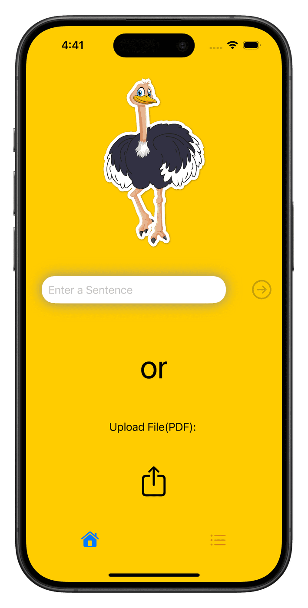

# loaly

	

  Available on the App Store, Loaly is a MIDI music app that generates MIDI tracks based on text. Made for a piano, loaly can play up to 5 notes at once. After the song is generated, users can download or share their song, a MIDI music sequence, that can be used in applications like garageband with other instruments. Users can also save their songs in the app for later use. 
